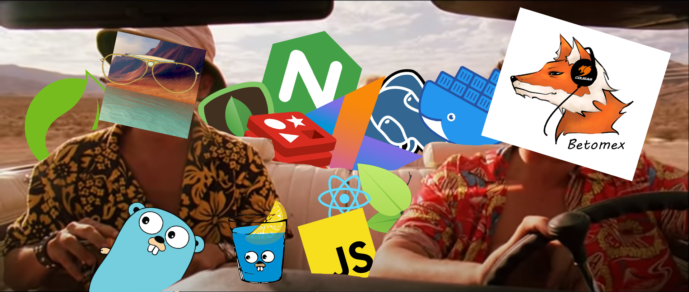
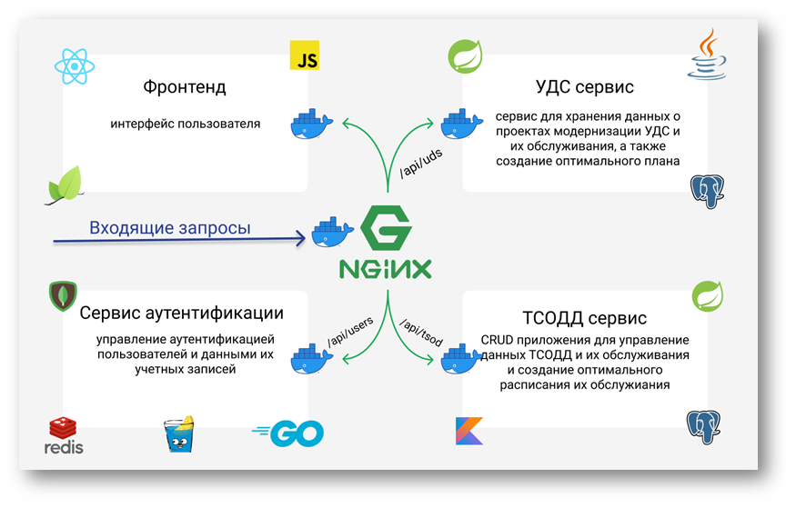

# Дипломный проект геоинформационные системы

Дипломный проект [TheTenzou](https://github.com/TheTenzou) и [Betomex](https://github.com/betomex), приложение позволяет составлять оптимальный план обслуживания ТСОДД(технические средства организации дорожного движения), и УДС(улично-дорожная сеть) на основе текущих данных.

## Технологии

 - Nginx, Docker.
 - Golang, Kotlin, Java, JavaScript.
 - Gin-gonic, Spring(Spring-Security, Spring-Data, Spring-web), React, Leaflet.
 - Redis, Mongodb, Postgres.

> 
> 
> У нас было 
> 2 дипломной работы, 
> 75 дней до нормоконтоля,
> 12 докер контейнеров,
> полсолонки shell скриптов и гора докер файлов,
> баз данных и всего такого, всех цветов,
> а ещё литр Kotlin'а, литр JavaScript'a, ящик Golang'a, пол-литра HTML и две дюжины Css файлов.
>
> Не то, чтобы это всё было нужно при написании диплома, но раз начал коллекционировать технологии, то иди в своём увлечении до конца.

## Архитектура



Приложение состоит из следующих сервисов:
 - Управление аккаунтами пользователей осуществляется сервисом аутентификации, написанном на Go с использованием Gin-gonic. Mongo используется для хранения данных пользователя. Redis - для refresh токенов.
 - ТСОДД сервис CRUD приложение для данных, связанных с ТСОДД, написанный на Kotlin с использованием Spring. Postgres используется для хранения данных. Оптимальный план обслуживания ТСОДД составляется при помощи Optaplanner.
 - УДС сервис CRUD приложение для данных связанных с модернизацией УДС, написанный на Java с использованием Spring. Postgres используется для хранения данных. Оптимальный план модернизации УДС составляется при помощи Optaplanner.
 - фронт написан на React с Leaflet для отображения карты.

## Запуск

Требования:
 - [Docker](https://www.docker.com/)

Выполнить следующею команду из корня проекта
```sh
docker-compose up
```

Приложение запустится на 8080 порте
